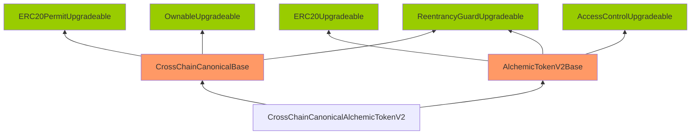

Petite Golden Crocodile

medium

# No gap array in xERC20 contracts

## Summary

When `CrossChainCanonicalAlchemicTokenV2` is upgraded, the storage variables of the `AlchemicTokenV2Base` will be overwritten due to a missing storage gap array in the `CrossChainCanonicalBase` contract.

## Vulnerability Detail

Below we can see the inheritance of the `CrossChainCanonicalAlchemicTokenV2`.

Contracts with `uint256[50] __gap;` defined are only the ones from OpenZeppelin. 



Lets review how the slots will be ordered, consider the left-to-right inheritance:

```solidity
contract CrossChainCanonicalAlchemicTokenV2 is CrossChainCanonicalBase, AlchemicTokenV2Base
```

Storage variables of the `CrossChainCanonicalBase` will be first and `AlchemicTokenV2Base` second.

## Impact

Storage of `AlchemicTokenV2Base` will be corrupted during upgrading, thus causing various issues in the `xERC20` implementation, such as initial mapping slots to be overwritten, for example [[_balances](https://github.com/OpenZeppelin/openzeppelin-contracts-upgradeable/blob/v4.7.0/contracts/token/ERC20/ERC20Upgradeable.sol#L37)] in `ERC20Upgradeable` contract can be completely modified because it is the leftmost inherited contract in `AlchemicTokenV2Base`.

## Code Snippet

AlchemixV2Base: https://github.com/sherlock-audit/2024-04-alchemix/blob/main/v2-foundry/src/AlchemicTokenV2Base.sol#L22-L36

CrossChainCanonicalBase: https://github.com/sherlock-audit/2024-04-alchemix/blob/main/v2-foundry/src/CrossChainCanonicalBase.sol#L12

## Tool used

Manual Review

## Recommendation

Consider defining an appropriate storage gap in each upgradeable parent contract at the end of all the storage variable definitions as follows:

```solidity
uint256[50] __gap; // gap to reserve storage in the contract for future variable additions
```

References:

- Notional in Sherlock: https://github.com/sherlock-audit/2022-09-notional-judging/issues/64
- Notional in OZ: https://blog.openzeppelin.com/notional-audit